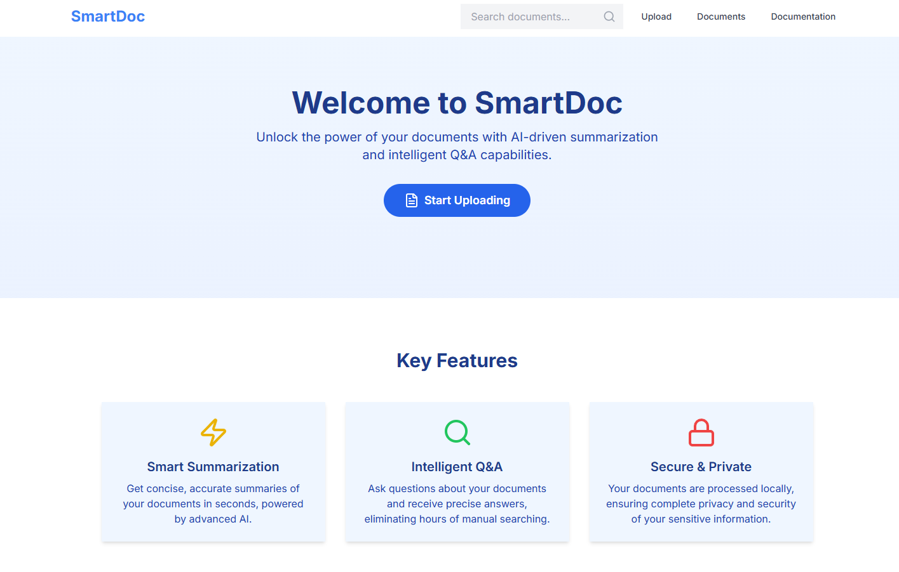
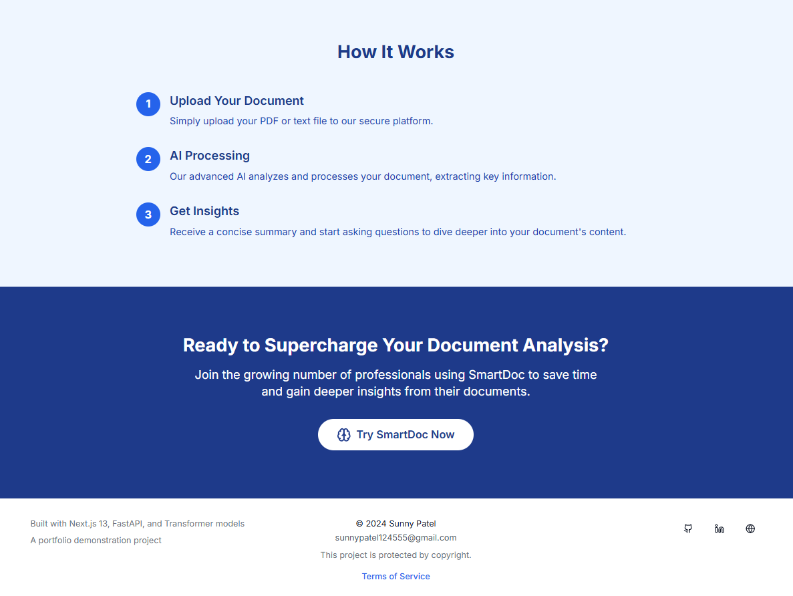
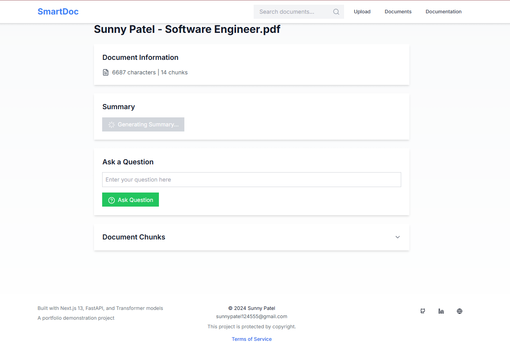

<div align="center">
    <strong style="font-size: 24px;">SmartDoc AI 🤖</strong>
    <br>
    A self-hosted AI document summarizer and Q&A system that processes documents locally - no API keys needed.
</div>





## Features

- 🔎 Document upload and text extraction (PDF/TXT) 
- 📝 Automatic document summarization
- ❓ Question answering system
- 🔍 Semantic search using FAISS
- 💻 Local processing with no external APIs
- ⚡ FastAPI backend ready for React frontend


## Tech Stack

- **Frontend**: React/Next.js, TailwindCSS
- **Backend**: FastAPI
- **AI Models**:
  - Summarization: `t5-small` (~300MB)
    ```python
    summarizer = pipeline(
        "summarization",
        model="t5-small",
        tokenizer="t5-small",
        framework="pt"
    )
    ```
  - Q&A: `distilbert-base-uncased-distilled-squad` (~250MB)
    ```python
    qa_model = pipeline(
        "question-answering", 
        model="distilbert-base-uncased-distilled-squad",
        framework="pt"
    )
    ```
  - Embeddings: `all-MiniLM-L6-v2` (~90MB)
    ```python
    embedding_model = SentenceTransformer("all-MiniLM-L6-v2")
    ```
  - Vector Search: FAISS

Total model size: ~640MB


## Setup & Installation
### Windows Environment Setup (Backend)
1. Create virtual environment:
```bash
python -m venv venv
```

2. Activate virtual environment:
```bash
venv\Scripts\activate
```

3. Install required packages:
```bash
pip install fastapi uvicorn python-multipart PyPDF2 transformers sentence-transformers faiss-cpu torch numpy
```
or run `pip install -r requirements.txt` to install all the dependencies

# Run the server
```bash
uvicorn smartdoc_backend:app --reload
```
Server will be available at `http://127.0.0.1:8000`. If by chance it isn't that IP, check your CLI it will display the available IP it chose and port

> Chute (end) the virtual environment using `deactivate` command 

### Frontend Setup (Next.js)
1. Navigate to frontend directory:
cd `.\frontend\`

2. Install Node.js dependencies:
`npm install`

3. Start development server:
`npm run dev`

Frontend available at: `http://localhost:3000`

## Model Storage

Models are cached in:
- Windows: `C:\Users\<YourUsername>\.cache\huggingface\hub`
- Linux/MacOS: `~/.cache/huggingface/hub`

## API Endpoints
### Document Management

- `POST /upload` - Upload PDF/text documents
- `GET /documents` - List all documents
- `GET /document/{doc_id}` - Get document metadata

### AI Features

- `GET /document/{doc_id}/summary` - Generate document summary
- `POST /document/{doc_id}/query` - Ask questions about document content
- `GET /document/{doc_id}/chunks` - Get document chunks (debug)

## Usage Example without frontend

```python
import requests

# Upload a document
files = {'file': open('document.pdf', 'rb')}
response = requests.post('http://127.0.0.1:8000/upload', files=files)
doc_id = response.json()['doc_id']

# Get a summary
summary = requests.get(f'http://127.0.0.1:8000/document/{doc_id}/summary')

# Ask a question
query = {'query': 'What is this document about?'}
answer = requests.post(f'http://127.0.0.1:8000/document/{doc_id}/query', json=query)
```

## License
MIT License - See [LICENSE](LICENSE) for more details.
